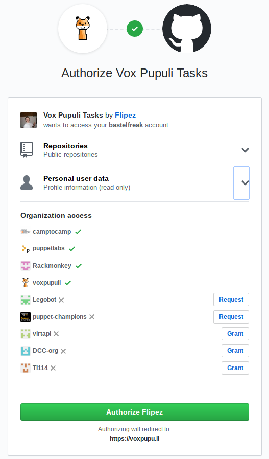
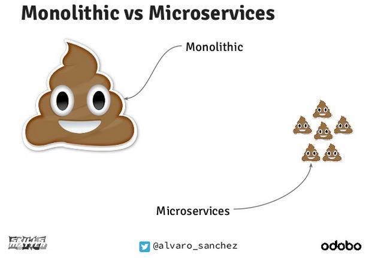

# Vox Pupuli Tasks - The Webapp for community management

[](https://travis-ci.org/voxpupuli/vox-pupuli-tasks)
[](LICENSE)
[](https://microbadger.com/images/voxpupuli/vox-pupuli-tasks)
[](https://microbadger.com/images/voxpupuli/vox-pupuli-tasks)
[](https://GitHub.com/voxpupuli/vox-pupuli-tasks/releases/)
[](https://hub.docker.com/r/voxpupuli/vox-pupuli-tasks)
[](https://hub.docker.com/r/voxpupuli/vox-pupuli-tasks)
[](https://www.codacy.com/app/VoxPupuli/vox-pupuli-tasks)

## Table of contents

* [Purpose](#purpose)
  * [Reviewing open Pull Requests](#reviewing-open-pull-requests)
  * [Yak shaving Puppet modules](#yak-shaving-puppet-modules)
* [Usage](#usage)
* [Existing Automatisation](#existing-automatisation)
  * [Merge Conflicts](#merge-conflicts)
* [Local Setup](#local-setup)
* [Production Setup](#production-setup)
  * [Cerebro](#cerebro)
  * [Elasticsearch](#elasticsearch)
  * [Kibana](#kibana)
  * [Sentry](#sentry)
* [Contribution](#contribution)
* [License](#license)
* [Sponsor](#sponsor)

## Purpose

As a collaborator at [Vox Pupuli](https://voxpupuli.org) we have basically two
different kinds of main tasks:

* Reviewing open Pull Requests
* Yak shaving [Puppet modules](https://forge.puppet.com/puppet)

We currently have a few tools for those jobs:

## Reviewing open Pull Requests

* [https://octobox.io/](https://octobox.io/) is a nice external webinterface to work with github issues and pull requests
* [https://voxpupuli-open-prs.herokuapp.com/](https://voxpupuli-open-prs.herokuapp.com/) is [our own](https://github.com/voxpupuli/open-prs#vox-pupuli-open-prs) Sinatra app to display all pull requests
* GitHub has a nice search function for [pull requests](https://github.com/pulls?q=is%3Aopen+is%3Apr+user%3Avoxpupuli+archived%3Afalse+sort%3Acreated-asc) but also [for issues](https://github.com/issues?q=is%3Aopen+is%3Aissue+user%3Avoxpupuli+archived%3Afalse+sort%3Acreated-asc)
* The [community_management](https://github.com/underscorgan/community_management#community-management) project provides some CLI tools to generate different reports about open pull requests

Collaborators review a lot of code in many pull requests. But there are even
more pull requests that are open but don't need any attention. A collaborator
spends a lot of time to figure out which pull request actually needs attention.

One of the goals of this project is to provide a proper UI that displays
filtered pull requests. Some examples:

It's not required to review code in a pull request if a merge conflict exists.
If the PR is properly labeled, we can exclude it from the UI. The service gets
notifications from GitHub for each activity on a PR. If a conflict appears, a
label will be added. It will also automatically be removed if the conflict
disappears after a rebase.

Instead of dealing with all open PRs over and over, collaborators can spend
their time to reviewing pull requests that actually need it.

Some more examples are documented as [open issues](https://github.com/voxpupuli/vox-pupuli-tasks/issues/), in particular [issue 4](https://github.com/voxpupuli/vox-pupuli-tasks/issues/4)

## Yak shaving Puppet modules

* The [get_all_the_diffs](https://github.com/voxpupuli/modulesync_config/blob/master/bin/get_all_the_diffs) script, which detects inconsistencies in modules

This is the second big tasks for collaborators. Update dependencies in
metadata.json files, allow new Puppet versions, drop legacy operating systems.
There are many many tasks that collaborators do dfrom time to time and this
project tries to make it as easy as possible or even automate stuff where it's
suitable.

## Usage

You can currently access a beta version at [voxpupu.li](https://voxpupu.li).
This is a MVP that we redeploy with enhancements every few days at the moment.
The app uses GitHubs OAuth for authentication:

[](https://voxpupu.li)

The application is developed by
[Robert 'flipez' Müller](https://github.com/flipez) and
[Tim 'bastelfreak' Meusel](https://github.com/bastelfreak). The current OAuth
app is registed to their personal account but will soon be migrated to the Vox
Pupuli GitHub organisation. You do not need to grant the application access to
any repository. This OAuth setup is only used to authenticate the user.

In the future it's possible to restrict the login or certain features to people
that are members of specific GitHub organisations or teams. We didn't want to
reimplement a whole usermanagement so we rely on GitHub OAuth.

After the login, you see the following page:

[](https://voxpupu.li)

Each yak shaving task is a row. It's prefixed with the number of modules that
are in this category. For example:

[](https://voxpupu.li)

You can click on each PR. The app displays all the information that GitHub
provides. It will also list open pull requests. It will be possible to filter
this. The filtering will also work for all open pull requests in a namespace.
The design and scope is currently discussed and implemented in
[Issue #4](https://github.com/voxpupuli/vox-pupuli-tasks/issues/4).

Besides being an OAuth application, this Ruby on Rails website is also a
registered GitHub Application. This means that GitHub sends notifications
for user interactions to the Rails app. The app gets information about every
new pull request, new label, new code or comments in a pull request and much
more. We currently store those notifications in a self hosted
[Sentry](#sentry). The displayed data in the frontend comes from polling the
GitHub API and from analysing the notifications. In the future we all add more
automisation to the app, which will be based on the notifications. Use cases for
automisation are discussed and developed at:

* [Issue #1](https://github.com/voxpupuli/vox-pupuli-tasks/issues/1) - handle merge conflicts
* [Issue #2](https://github.com/voxpupuli/vox-pupuli-tasks/issues/2) - handle CI failures

Other [open issues](https://github.com/voxpupuli/vox-pupuli-tasks/issues) might
also be good candidates for live interactions based on notifications. Please
comment the open issues or raise new ones if you have crazy ideas.

## Existing Automatisation

We aim to automate different use cases. Each usecase gets a dedicated milestone
at [GitHub](https://github.com/voxpupuli/vox-pupuli-tasks/milestones) to track
the issues and pull requests.

### Merge Conflicts - [Milestone 1](https://github.com/voxpupuli/vox-pupuli-tasks/milestone/1)

At the moment, the application handles appearing and disappearing merge
conflicts. Since
[PR #35](https://github.com/voxpupuli/vox-pupuli-tasks/pull/35) went live, we
are able to detect if a Pull request went from a mergeable into a non-mergeable
state. In this case we check if the label `needs-rebase` is present in the
repository. Afterwards we add it to the pull request.

[](https://voxpupu.li)

Also our bot Account adds a comment to the pull request. GitHub does not send
notifications to the author whe a label was added, but for comments.

## Local Setup

To start the app locally, do the following (assumes that you've ruby, bundler
and yarn available, also redis needs to be started):

```sh
git clone git@github.com:voxpupuli/vox-pupuli-tasks.git
cd vox-pupuli-tasks
bundle install --jobs $(nproc) --with development test --path vendor/bundle
bundle exec yarn install --frozen-lockfile --non-interactive
export SECRET_KEY_BASE=$(bundle exec rails secret)
bundle exec rails assets:precompile
# somehow generate config/master.key
RAILS_ENV=development bundle exec rails db:migrate
bundle exec foreman start
```

Secrets are stored as an encrypted yaml file. You can edit them by doing:

```sh
bundle exec rails credentials:edit
```

This only works properly if one od the developers sent you the `/config/master.key`
file.

[Foreman](https://rubygems.org/gems/foreman) will take care of the actual rails
application, but it will also start [sidekiq](https://github.com/mperham/sidekiq#sidekiq).

## Production Setup

The production setup is a homage to microservices:



The setup is deployed as docker microservices. This repository contains a
[docker-compose.yaml](docker-compose.yaml) for this.

We deploy multiple containers:

* watchtower
* [cerebro](https://github.com/lmenezes/cerebro#cerebro)
* Elasticsearch
* Redis
* Sidekiq
* [Kibana](https://www.elastic.co/products/kibana)
* [Sentry](https://sentry.io/welcome/)
* The actual application

### Cerebro

This is a webinterface for Elasticsearch. The service is available at
localhost:9001. We highly suggest that you deploy an nginx in front of it with
proper TLS certiicates. To access the elasticsearch container, you can use this
URL:

`http://localhost:9001/#/overview?host=http:%2F%2Felasticsearch:9200`

The `docker-compose.yaml` sets `elasticsearch` as FQDN for the container.

### Elasticsearch

We use the [semantic logger](https://rocketjob.github.io/semantic_logger) to
log all rails data to elasticsearch. Logs are important, and writing them to a
file in a container is a bad idea.

### Kibana

Kibana is our frontend for elasticsearch. It's available at localhost on port
5601.

## Sentry

ToDo: Describe how we forward errors to Sentry

## Contribution

We have a helpful rake task available to run a ruby linter. It will inform you
about styleguide violations. Please execute it before you provide a pull
request:

```sh
bundle exec rake rubocop
```

This will execute the linter. You can also advice him to automatically fix
things (works often, but not on all issues):

```sh
bundle exec rake rubocop::auto_correct
```

## License

This project is licensed under [GNU Affero General Public License version 3](LICENSE)

## Sponsor

This project is sponsored by [Hetzner Cloud](https://hetzner.com/cloud). They
provide us with free cloud instances to host the application.

[](https://hetzner.com/cloud)

Are you interested as well in sponsoring parts of the Vox Pupuli organisation?
Get in touch with the [Project Management Committee](mailto:pmc@voxpupuli.org).
